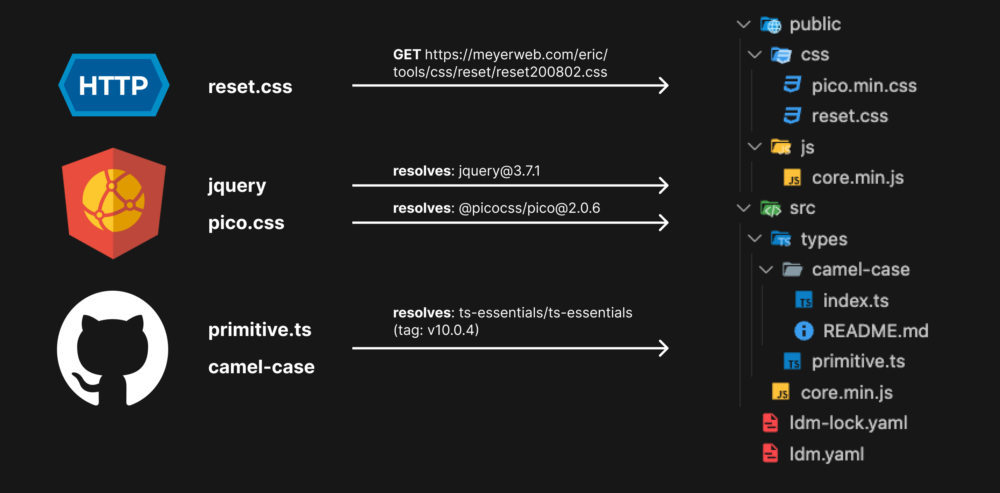

<p align="center">
<a href="#">

</a>
</p>

<h1 align="center">
Loose Dependency Manager
</h1>
<p align="center">
Wire-up fragmented codes and files from various sources with a single command.
<p>
<p align="center">
  <a href="https://www.npmjs.com/package/loose-dependency-manager"></a>
<p>

<p align="center">
 <a onclick="alert('Documentation is not ready yet. I\'ll try to write it ASAP.')" href="#">Documentation</a> | <a href="#quick-start">Getting Started</a> | <a href="#examples">Examples</a>
</p>
<p align="center">
<a href="#what-is-loose-dependency-manager">What is loose dependency manager?</a>
</p>

<h4 align="center">

</h4>
<br>
<br>

## What is loose dependency manager?

Loose Dependency Manager (`ldm`) is a tool that helps you manage dependencies from various sources in a single file.

You can think of it as a sophisticated form of [scp](https://en.wikipedia.org/wiki/Secure_copy_protocol) command
that can be configured with a single specification file (`ldm.yaml`) 
and that supports versioning (if the remote source supports it) and locking mechanism.

Currently, it supports the following sources:

| Provider | Versioning Support | Can Download | URI Format |
| --- | --- | --- | --- |
| HTTP(S) | ❌ | only files | HTTP(S) URL |
| GitHub | ✅ | files & directories | `<github-source-id>:///path/to/file` |
| jsdelivr (npm) | ✅ | files & directories | `<jsdelivr-source-id>://default` or `<jsdelivr-source-id>:///path/to/file` |
| jsdelivr (github) | ✅ | files & directories | `<jsdelivr-source-id>:///path/to/file` |

## Installation

```sh
npm install -g loose-dependency-manager
```

## Quick Start

You write a dependency specification file named `ldm.yaml`. 

> [!IMPORTANT]
> **It is stronlgly recommended to set `auth.token` with personal access token**
> **when using GitHub as a source provider (even if you're using for public repositories).**
> Github API imposes a harsh rate limit of 60 requests per hour for unauthenticated requests, 
> so you may run into rate limit issues without a token.

```yaml
version: "1"

dependencies:
  primitive.ts:
    uri: "@ts-essentials/ts-essentials:///lib/primitive/index.ts"
    version: latest
    destination: src/types/primitive.ts
  camel-case:
    uri: "@ts-essentials/ts-essentials:///lib/camel-case"
    version: latest
    destination: src/types/camel-case
  jquery:
    uri: jquery://default
    version: ^3.6.4
    destinations:
      - src/core.min.js
      - public/js/core.min.js
  reset.css:
    uri: https://meyerweb.com/eric/tools/css/reset/reset200802.css
    destination: public/css/reset.css
  pico.css:
    uri: "@picocss/pico:///css/pico.min.css"
    version: ^2.0.0
    destination: public/css/pico.min.css

sources:
  "@ts-essentials/ts-essentials":
    provider: github
    uri: ts-essentials/ts-essentials
    auth:
      token: ${GITHUB_TOKEN}
  jquery:
    provider: jsdelivr:npm
    uri: jquery
  "@picocss/pico":
    provider: jsdelivr:npm
    uri: "@picocss/pico"

config:
  envFile: .env
  deleteFilesOnRemove: true
```

Then in terminal, run the following command.

```sh
ldm install
```

This will produce the following file sturcture, 
assuming that `ldm.yaml` is the only file in the directory.

```
|- ldm.yaml
|- ldm-lock.yaml
|--- src/
|----- core.min.js
|----- types/
|------- primitive.ts
|------- camel-case/
|--------- index.ts
|--------- README.md
|--- public/
|----- css/
|------- reset.css
|------- pico.min.css
|----- js/
|------- core.min.js
```

The example above can be summarized as following diagram.



## Examples

You can find examples at e2e test scenarios.

Compare `given` and `expected` directory in each scenario
to see what the execution of `scenario.ts#scenario.command` will produce.

- [install](./tests/install/scenarios)
- [upgrade](./tests/upgrade/scenarios)

## Contribution

See [Contributing Guide](./.github/CONTRIBUTING.md)

## License

[MIT](./LICENSE) License © 2021-Present [Joseph Hwang](https://github.com/01Joseph-Hwang10)
